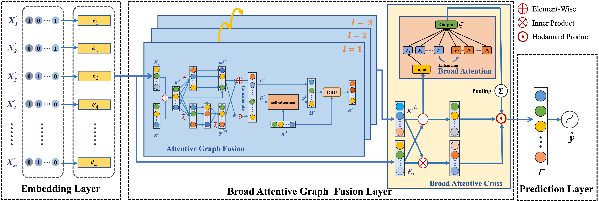

# BaGFN: Broad Attentive Graph Fusion Network for High-Order Feature Interactions

## Introduction

Modeling feature interactions is of crucial significance to 
high-quality feature engineering on multi-filed sparse data.
At present, a series of state-of-the-art methods extract cross features in 
a rather implicit bit-wise fashion and lack enough comprehensive and 
flexible competence of learning sophisticated interactions among different feature fields.
Broad Attentive Graph Fusion Network (BaGFN) better models high-order feature interactions in a flexible and explicit manner.
On the one hand, we design an attentive graph fusion module to
strengthen high-order feature representation under graph structure. 
The graph-based module develops a new bilinear-cross aggregation function to aggregate the graph node information, 
employs the self-attention mechanism to learn the impact of neighborhood nodes,
and updates the high-order representation of features by multi-hop fusion steps.
On the other hand, we further construct broad attentive cross module to 
refine high-order feature interactions at a bit-wise level.
The optimized module designs a new broad attention mechanism to 
dynamically learn the importance weights of cross features and 
efficiently conduct the sophisticated high-order feature interactions at
the granularity of feature dimensions.



## Requirements

The code runs on the following environment:
- Tensorflow 1.14
- python 3.6
- CUDA 10.0+ (For GPU)
- Other requirements: `pip install -r requirements.txt`

## Usage

### Data Process:

- Datasets (Avazu and Criteo) can be downloaded from [Kaggel Avazu](https://www.kaggle.com/c/avazu-ctr-prediction), 
  [Kaggle Criteo](https://www.kaggle.com/c/criteo-display-ad-challenge/data)
- Please refer to [data precoss](data/README.md).

### How to run:
  
- Since the [train_examples.txt](data/train_examples.txt) is tiny, we run the training with batch_size=4: 
  `CUDA_VISIBLE_DEVICES=0 python train.py --batch_size 4`
- Default training configs can be modified in function `parse_args` of [train.py](train.py).
- Feel free to run the code with specifically parameters on whole dataset: 
```shell
CUDA_VISIBLE_DEVICES=0 python train.py \
                        --embedding_size 20 \
                        --num_gnn 3 \
                        --epoch 3 \
                        --batch_size 1024 \
                        --learning_rate 0.001 \
                        --optimizer_type adam \
                        --field_size 39 \
                        --checkpoint_dir ./checkpoints/Criteo \
                        --log_dir ./logs/Criteo \
                        --data Criteo  \
                        --data_path ./data/Criteo/   \
                        --run_times 1
```
## Docker demo

Have a fast start with [docker demo](docker/README.md).

## Citation

If you find BaGFN useful for your research, please consider citing the following paper:

```
@article{xie2021bagfn,
    title={BaGFN: Broad Attentive Graph Fusion Network for High-Order Feature Interactions},
    author={Xie, Zhifeng and Zhang, Wenling and Sheng, Bin and Li, Ping and Chen, C. L. Philip},
    journal={IEEE Transactions on Neural Networks and Learning Systems},
    year={2021},
    volume={},
    number={},
    pages={1-15},
    doi={10.1109/TNNLS.2021.3116209}
}
```

## Acknowledgement

This code repository gets inspirations from Song's 
[Autoint](https://github.com/DeepGraphLearning/RecommenderSystems/tree/master/featureRec).
